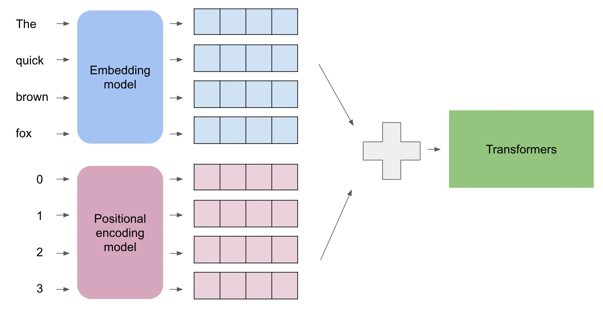

# PyTorch Transformer Tutorial: Implementing 'Attention Is All You Need'


This project began as my own attempt to implement and understand the Transformer model. I have converted my notes and code into this public tutorial, aiming to provide a clear, well-documented, and **intuitive** implementation of the Transformer model. The implementation closely follows the seminal paper ["Attention Is All You Need"](https://arxiv.org/abs/1706.03762) by Vaswani et al. (2017), and is intended to complement the existing wealth of tutorials.

Note: This implementation is intended for educational purposes and does not introduce novel implementations. For production use or advanced features, more robust implementations are available elsewhere.

## 🎯 Project Goal

The primary goal of this project is **educational**. The aim is to explain the Transformer architecture by breaking it down into its fundamental components and implementing each part with clear code and intuitive descriptions. Whether you are new to Transformers, studying NLP, or looking for a foundational implementation to build upon, this repository is designed for you.

Drawing inspiration from the best educational practices and resources available, this implementation prioritises:

*   **Clarity**: Writing readable code with extensive comments and docstrings.
*   **Modularity**: Separating the architecture into distinct, understandable modules (e.g., Multi-Head Attention, Positional Encoding, Encoder/Decoder Layers).
*   **Intuition**: Providing explanations that build an intuitive understanding of *why* each component exists and how it works, complementing the code.
*   **Correctness**: Ensuring the implementation aligns with the original paper and includes unit tests for core logic.

## 📚 What's Inside?

*   **`src/transformer`**: The core PyTorch implementation of the Transformer model, broken down into logical modules.
*   **`tests/`**: Pytest unit tests for key components.
*   **This `README.md`**: A detailed walkthrough explaining the theory and code for each part of the Transformer.
*   **`examples/`**: (Coming Soon) Example script(s) showing how to use the model.

We'll explore the architecture piece by piece, starting with the fundamental building blocks.

---

## 🤖 Understanding the Transformer Core Idea

To understand the Transformer's core idea, consider how we process language.

Imagine reading: "The **cat**, which chased the **mouse** all morning, finally **sat** on the **mat**."

To understand "**sat**", you connect it to "**cat**" (who sat?) and "**mat**" (where?). You naturally pay *attention* to relevant context words, even distant ones, while likely down-weighting less relevant words like "mouse" for this specific action.

Traditional sequence models, like Recurrent Neural Networks (RNNs), often process words sequentially, which can make capturing long-distance relationships difficult.

**Transformers, using their core mechanism called "self-attention", work differently.** They can weigh the relevance of all words simultaneously when considering a specific word. For "sat", self-attention calculates relevance scores for every other word, assigning higher weights to contextually important words ("cat", "mat") and lower weights to others ("mouse").

Think of it like drawing connection lines between words: for "sat", strong lines would connect to "cat" and "mat". This ability to dynamically weigh the importance of all other words when processing each individual word is key to the Transformer's effectiveness. It allows the model to capture complex relationships and long-range dependencies within text much more effectively than older architectures.

This fundamental difference explains why Transformers underpin many state-of-the-art models (e.g. ChatGPT) used for tasks like machine translation, summarisation, and question answering.

We'll examine the components that enable this.

---

## 🧬 Input Representation: Embeddings & Positional Encoding (`src/transformer/embedding.py`)

Before processing text, the Transformer needs numerical representations that capture both word meaning and word order. This involves two steps:

1.  **Token Embedding**: Converting words (tokens) into dense numerical vectors.
2.  **Positional Encoding**: Adding information about each token's position in the sequence.

### 1. Token Embeddings: Representing Meaning

Computers require numerical input. Token embeddings map each unique word in the vocabulary (e.g., "cat", "sat", "mat") to a specific vector of numbers (e.g., 512 numbers long). This is handled by an embedding layer (`torch.nn.Embedding` in PyTorch), essentially a lookup table mapping word IDs to vectors.

Crucially, these vectors are *learned* during training. Words with similar meanings or usage patterns tend to develop vectors that are closer together in the vector space. This allows the model to capture semantic relationships. The size of these vectors is the model dimension, `d_model`.

The original paper also scales the embedding output by \\(\\sqrt{d_{\\text{model}}}\\), which helps stabilise learning when combined with positional encodings.

```python
# Code from src/transformer/embedding.py
class TokenEmbedding(nn.Module):
    """Converts token indices to embeddings and scales them.

    Multiplies the embedding by sqrt(d_model) as per the paper.
    """

    def __init__(self, vocab_size: int, d_model: int):
        """


        Args:
            vocab_size (int): The size of the vocabulary.
            d_model (int): The embedding dimension.
        """
        super().__init__()
        self.embedding = nn.Embedding(vocab_size, d_model)
        self.d_model = d_model

    def forward(self, tokens: torch.Tensor) -> torch.Tensor:
        """Performs the embedding lookup and scaling.

        Args:
            tokens (torch.Tensor): Input tensor of token indices.

        Returns:
            torch.Tensor: The resulting embeddings, scaled.
        """
        return self.embedding(tokens.long()) * math.sqrt(self.d_model)
```

### 2. Positional Encoding: Representing Order

\

*Figure: Visualisation of combining embeddings with positional encodings. A common encoding model is, for example, the trigonometric transforms above. (Image Credit: Xuer Chen; [Link](https://medium.com/@xuer.chen.human/llm-study-notes-positional-encoding-0639a1002ec0))*

Self-attention processes all words simultaneously, losing the inherent sequence order. "The cat sat on the mat" differs from "The mat sat on the cat". We need to explicitly provide positional information.

Positional Encoding adds a vector to each token embedding, indicating its position (first, second, etc.). It's analagous to a 'timestamp' for the position of the word. This vector has the same dimension (`d_model`) as the token embedding. The original Transformer uses sine and cosine functions of different frequencies:

\[ PE(pos, 2i) = \\sin(pos / 10000^{2i / d_{\\text{model}}}) \\]
\[ PE(pos, 2i+1) = \\cos(pos / 10000^{2i / d_{\\text{model}}}) \\]

Where:
*   `pos` is the position of the word in the sequence (0, 1, 2, ...).
*   `i` is the dimension index within the embedding vector (0, 1, ..., `d_model`/2 - 1).
*   `d_model` is the embedding dimension.

Why this specific formula? It has several desirable properties:
1.  **Unique Encoding**: Each position `pos` gets a unique vector.
2.  **Consistent Offset**: For any fixed offset `k`, \( PE_{pos+k} \) can be represented as a linear function of \( PE_{pos} \). This makes it easier for the model to learn about relative positions.
3.  **Bounded Values**: The sine and cosine values are always between -1 and 1, keeping the scale consistent.
4.  **Smoothness**: The values change smoothly across positions.

This positional encoding vector has the *same dimension* (`d_model`) as the token embedding vector. We simply **add** the positional encoding vector to the corresponding token embedding vector. This combined vector now contains information about both the word's meaning and its position in the sequence.

```python
# Code from src/transformer/embedding.py
class PositionalEncoding(nn.Module):
    """Injects positional information into the input embeddings.

    By position, we literally mean the position of the token in the sequence
    (e.g. the first token, the second token, etc.)

    The positional encodings have the same dimension as the embeddings
    so that the two can be summed. Here, we use sine and cosine
    functions of different frequencies.
    """

    def __init__(self, d_model: int, max_len: int = 5000, dropout: float = 0.1):
        """


        Args:
            d_model (int): The embedding dimension.
            max_len (int): The maximum sequence length.
            dropout (float): The dropout probability.
        """
        super().__init__()
        self.dropout = nn.Dropout(p=dropout)

        position = torch.arange(max_len).unsqueeze(1)
        div_term = torch.exp(
            torch.arange(0, d_model, 2) * (-math.log(10000.0) / d_model)
        )
        pe = torch.zeros(max_len, 1, d_model)
        pe[:, 0, 0::2] = torch.sin(position * div_term)
        pe[:, 0, 1::2] = torch.cos(position * div_term)
        # pe shape: [max_len, 1, d_model]
        self.register_buffer("pe", pe) # Register as buffer to prevent training

    def forward(self, x: torch.Tensor) -> torch.Tensor:
        """Adds positional encoding to the input tensor.

        Args:
            x (torch.Tensor): The input tensor. Expected shape: (seq_len, batch_size, embedding_dim).

        Returns:
            torch.Tensor: The output tensor with positional encoding added.
        """
        # x shape: [seq_len, batch_size, embedding_dim]
        # self.pe[: x.size(0)] shape: [seq_len, 1, embedding_dim] - Broadcasts over batch dim
        # Need to transpose x for addition if batch_first=True for the main model
        # Assuming x is (seq_len, batch_size, d_model) here based on buffer shape
        x = x + self.pe[: x.size(0)]
        return self.dropout(x)
```
*Note: The `TransformerEmbedding` class in `embedding.py` simply combines these two steps, applying token embedding, scaling, positional encoding, and dropout in sequence.*

```python
# Code structure from src/transformer/embedding.py
class TransformerEmbedding(nn.Module):
    def __init__(self, vocab_size: int, d_model: int, max_len: int = 5000, dropout: float = 0.1):
        # ... initialisation of token_embedding and positional_encoding ...
        super().__init__()
        self.token_embedding = TokenEmbedding(vocab_size, d_model)
        self.positional_encoding = PositionalEncoding(d_model, max_len, dropout)

    def forward(self, tokens: torch.Tensor) -> torch.Tensor:
        # 1. Apply token embedding and scaling
        x = self.token_embedding(tokens)
        # 2. Add positional encoding and apply dropout
        x = self.positional_encoding(x)
        return x
```

The output of this stage is a sequence of vectors, where each vector represents a token enriched with its positional information, ready to be fed into the main Transformer blocks.

---

## ✨ Attention Mechanism: Relating Words (`src/transformer/attention.py`)

The core mechanism of the Transformer is **attention**, specifically **Scaled Dot-Product Attention** and its multi-headed variant. This allows the model to weigh the importance of different words when processing a particular word.


*Figure: Visualisation of attention focus for the word 'it'. (Image Credit: Jay Alammar; [Link](https://jalammar.github.io/illustrated-transformer))*


### 1. Scaled Dot-Product Attention

#### Intuition 

Imagine you're making a fruit smoothie. You have a *recipe query* (what kind of smoothie do I want? Maybe "something sweet and red"). You look at your available *fruits* (apples, bananas, strawberries, lemons). Each fruit has *keys* (descriptions like "red", "sweet", "sour", "yellow") and *values* (the actual fruit substance).

Your brain quickly compares your "sweet and red" query to the keys of each fruit.
*   Strawberry: Keys match "sweet" and "red" well. High score! Value: Strawberry pulp.
*   Apple: Keys match "sweet" okay, but not "red". Medium score. Value: Apple pulp.
*   Banana: Keys don't match "red". Low score. Value: Banana pulp.
*   Lemon: Keys match neither "sweet" nor "red". Very low score. Value: Lemon juice.

You then create your smoothie by mixing the *values* (fruit substances) based on their *scores*. You'll use a lot of strawberry (high score), a little apple (medium score), and maybe no banana or lemon (low scores).

Scaled Dot-Product Attention works similarly:

1.  **Query (Q)**: Represents the current word asking, "What context is relevant to me?"
2.  **Key (K)**: Represents all words offering information, saying, "Here's what I'm about."
3.  **Value (V)**: Represents the actual content/meaning of the words offering information.

The mechanism calculates a score between the Query (Q) of the current word and the Key (K) of every other word (including itself). A higher score means higher relevance.

The formula is:
\[ \\text{Attention}(Q, K, V) = \\text{softmax}\\left(\\frac{QK^T}{\\sqrt{d_k}}\\right)V \]

Where:
*   \(Q\): Matrix of queries (shape: `[batch_size, num_queries, d_k]`).
*   \(K\): Matrix of keys (shape: `[batch_size, num_keys, d_k]`).
*   \(V\): Matrix of values (shape: `[batch_size, num_values, d_v]`). Usually, `num_keys == num_values`.
*   \(d_k\): Dimension of the keys and queries.
*   \(QK^T\): Dot products between each query and all keys, resulting in raw attention scores (shape: `[batch_size, num_queries, num_keys]`).
*   \(\\sqrt{d_k}\): Scaling factor to prevent excessively large dot products, especially with high dimensions.
*   `softmax`: Applied row-wise to the scaled scores, converting them into weights that sum to 1 for each query.
*   The final matrix multiplication weights the Value vectors according to the attention scores. The output shape is `[batch_size, num_queries, d_v]`.

### 2. Multi-Head Attention

#### Intuition 

Instead of performing attention once with large Q, K, V vectors, Multi-Head Attention splits them into smaller pieces ("heads").

Rather than making just one smoothie based on your single "sweet and red" query, imagine having several *different* recipe queries simultaneously. Maybe:
*   Head 1: "Sweet and red" (focuses on strawberries)
*   Head 2: "Yellow and creamy" (focuses on bananas)
*   Head 3: "Crisp and tangy" (focuses on apples, maybe lemon)
*   Head 4: "Anything high in vitamin C" (focuses on strawberries and lemons)

Each "head" performs the query-key-value attention process independently, focusing on different aspects or relationships within the fruit bowl. Afterwards, you combine the small smoothies from each head into one final, complex smoothie.

Multi-Head Attention does this for words. Instead of calculating attention once with the full `d_model`-sized Q, K, V vectors, it splits them into multiple smaller sets (e.g., 8 "heads"). Each head gets its own smaller Q, K, V projections and calculates attention independently. This allows each head to potentially focus on different types of relationships or contextual information (e.g., one head might focus on subject-verb agreement, another on nearby adjectives).

The outputs from all heads are then concatenated and passed through a final linear layer to produce the final output vector, which integrates the insights from all attention heads.

#### Definition and Explanation

Multi-Head Attention involves these steps:

1.  **Linear Projections**: The input embeddings (or outputs from the previous layer) are linearly projected `h` times (where `h` is the number of heads) with different, learned linear projections (weight matrices \(W^Q_i, W^K_i, W^V_i\)) to create the Q, K, and V vectors for each head:
    \[ \\text{head}_i = \\text{Attention}(QW^Q_i, KW^K_i, VW^V_i) \]
    The dimensions are typically split such that \(d_k = d_v = d_{\\text{model}} / h\).
2.  **Scaled Dot-Product Attention**: Attention is calculated independently for each head using the formula above.
3.  **Concatenation**: The outputs from all heads are concatenated:
    \[ \\text{MultiHead}(Q, K, V) = \\text{Concat}(\\text{head}_1, ..., \\text{head}_h) \]
    The shape is now `[batch_size, seq_len, d_model]`.
4.  **Final Linear Projection**: The concatenated output is passed through a final linear layer (with weight matrix \(W^O\)) to produce the final output:
    \[ \\text{MultiHead}(Q, K, V) = \\text{Concat}(\\text{head}_1, ..., \\text{head}_h)W^O \]


This allows the model to jointly attend to information from different representation subspaces.

```python
# Code from src/transformer/attention.py (Simplified view)

def scaled_dot_product_attention(
    query: Tensor, key: Tensor, value: Tensor, mask: Optional[Tensor] = None
) -> Tensor:
    d_k = query.size(-1)
    scores = torch.matmul(query, key.transpose(-2, -1)) / math.sqrt(d_k)
    if mask is not None:
        scores = scores.masked_fill(mask, float("-inf"))
    attn_weights = torch.softmax(scores, dim=-1)
    output = torch.matmul(attn_weights, value)
    return output

class MultiHeadAttention(nn.Module):
    def __init__(self, d_model: int, h: int, dropout: float = 0.1):
        super().__init__()
        # ... initialisation of linear layers (w_q, w_k, w_v, w_o) ...
        self.d_model = d_model
        self.h = h
        self.d_k = d_model // h

    def forward(self, query: Tensor, key: Tensor, value: Tensor, mask: Optional[Tensor] = None) -> Tensor:
        batch_size = query.size(0)

        # 1. Project Q, K, V
        q = self.w_q(query)
        k = self.w_k(key)
        v = self.w_v(value)

        # 2. Reshape for multi-head processing (batch_size, seq_len, d_model) -> (batch_size, h, seq_len, d_k)
        q = q.view(batch_size, -1, self.h, self.d_k).transpose(1, 2)
        k = k.view(batch_size, -1, self.h, self.d_k).transpose(1, 2)
        v = v.view(batch_size, -1, self.h, self.d_k).transpose(1, 2) # Note: d_v = d_k

        # 3. Apply scaled_dot_product_attention
        attn_output = scaled_dot_product_attention(q, k, v, mask=mask)

        # 4. Concatenate heads and reshape back (batch_size, h, seq_len, d_k) -> (batch_size, seq_len, d_model)
        attn_output = attn_output.transpose(1, 2).contiguous().view(batch_size, -1, self.d_model)

        # 5. Apply final linear layer
        output = self.w_o(attn_output)
        return output
```

This attention output is then typically passed through further processing steps like Add & Norm and Feed-Forward layers, which we'll cover next.

---

## Essential Layer Techniques

Encoder and Decoder layers rely on several key techniques: Masking, Add & Norm, and Feed-Forward Networks.

### 1. Masking: Handling Padding and Future Information

In practice, we often need to apply *masks* to the attention scores (`QK^T` from Scaled Dot-Product Attention) before the softmax step. This is crucial for two main reasons:

1.  **Padding Mask:** Input sequences often have different lengths. To process them in batches, we pad shorter sequences with special `<pad>` tokens. We don't want the model to pay attention to these padding tokens. A padding mask identifies the positions of these `<pad>` tokens. We add a large negative number (like `-1e9` or negative infinity) to the attention scores corresponding to these padded positions. After softmax, these positions will have scores very close to zero, effectively ignoring them.

2.  **Look-Ahead Mask (Decoder Only):** When predicting the next word in a sequence (e.g., during translation), the decoder should only attend to words that came *before* the current position. It shouldn't "cheat" by looking at future words. The look-ahead mask achieves this by masking out all future positions in the input sequence relative to the current position being calculated. This is typically done by creating an upper triangular matrix filled with large negative numbers.

Masking is implemented by adding the mask tensor (containing `True` or `1` for positions to ignore and `False` or `0` for positions to keep) to the scaled \\(QK^T\\) matrix *before* applying the softmax function. Helper functions to generate these masks based on padding indices or decoder context are typically placed in a separate module (like `src/transformer/masks.py`).

```python
# Conceptual implementation within scaled_dot_product_attention

# Example mask creation (masks are typically generated elsewhere):
# padding_mask = create_padding_mask(source_seq, pad_idx) # Shape: [batch_size, 1, 1, seq_len_k]
# look_ahead_mask = create_subsequent_mask(target_seq.size(1)) # Shape: [1, 1, seq_len_q, seq_len_q]
# combined_mask = padding_mask | look_ahead_mask # If both are needed

# scores shape: [batch_size, num_heads, seq_len_q, seq_len_k]
# scores = ... calculation of QK^T / sqrt(dk) ...

# mask shape needs to be broadcastable to scores shape.
# For example, a padding mask [batch_size, 1, 1, seq_len_k] broadcasts across heads and query positions.
# A look-ahead mask [1, 1, seq_len_q, seq_len_q] broadcasts across batch and heads.
if mask is not None:
    # Ensure mask has compatible dimensions for broadcasting over batch and head dimensions.
    # The mask usually has True where we want to mask.
    # Filling with a very large negative number (-1e9 or float('-inf')) ensures that these positions
    # receive near-zero probability after the softmax function.
    scores = scores.masked_fill(mask, float("-inf")) # Use float('-inf') for clarity

attention_weights = torch.softmax(scores, dim=-1)
```

### 2. Sublayer Connections: Add & Norm

Inside each Encoder and Decoder layer, after the main operations (self-attention or feed-forward network), there are two standard sub-steps: a **residual connection** followed by **layer normalisation**.

#### Intuition 

Imagine building a complex tower with LEGO blocks. Sometimes, adding a new fancy section (like our attention mechanism) might accidentally mess up the stability built by the previous sections. A **residual connection** is like keeping a direct support beam from the *input* of the new section straight to its *output*. So, if the new section isn't helpful or even makes things worse initially, the tower still has the original support from before. It makes it easier to build very deep towers without them collapsing during construction (training).

**Layer Normalisation** is like having a supervisor check the output of each section. They ensure the signals (numbers) coming out aren't getting wildly too large or too small, keeping everything in a consistent, manageable range. This helps stabilise the building process and makes training smoother.

#### Definition and Explanation

Each sub-layer (like Multi-Head Attention or the Feed-Forward Network) in the Transformer uses this structure:

\[ \\text{output} = \\text{LayerNorm}(x + \\text{Sublayer}(x)) \]

Where:
*   `x` is the input to the sub-layer.
*   `Sublayer(x)` is the function implemented by the sub-layer itself (e.g., `MultiHeadAttention` or `PositionwiseFeedForward`).
*   `x + Sublayer(x)` is the **residual connection**. We simply add the input `x` to the output of the sub-layer. This allows gradients to flow more directly back through the network during training, mitigating the vanishing gradient problem and making it easier to train deeper models.
*   `LayerNorm` is **Layer Normalisation**. Unlike Batch Normalisation which normalises across the batch dimension, Layer Normalisation normalises across the features (the `d_model` dimension) for *each* sequence item independently. It calculates the mean and standard deviation across the last dimension (features) and uses them to rescale the activations. This provides stability during training, making the model less sensitive to the scale of parameters and learning rates.

We will use the standard `torch.nn.LayerNorm` module provided by PyTorch for this. We will see the practical application of `torch.nn.LayerNorm` within the `EncoderLayer` and `DecoderLayer` code examples discussed later.

### 3. Position-wise Feed-Forward Networks (FFN) (`src/transformer/layers.py`)

The final essential component within each Encoder and Decoder layer is the Position-wise Feed-Forward Network (FFN).

#### Intuition 

Think of the attention mechanism as gathering relevant context for each word. The FFN is like a small, independent processing station *for each word* separately. After gathering context (attention), each word goes through this station to have its representation further refined and processed based on the context it just received. It's the same station (same set of weights) for every word, but each word passes through it individually (position-wise).

#### Definition and Explanation

This is a simple fully connected feed-forward network applied to each position (each token's vector) separately and identically. It consists of two linear transformations with a ReLU activation in between:

\[ \\text{FFN}(x) = \\max(0, xW_1 + b_1)W_2 + b_2 \]

Where:
*   `x` is the input vector for a specific position (shape `[batch_size, seq_len, d_model]`). The Add & Norm step is applied *before* this FFN sublayer.
*   \(W_1, b_1\) are the weights and bias of the first linear layer.
*   \(W_2, b_2\) are the weights and bias of the second linear layer.
*   `ReLU` is the Rectified Linear Unit activation function.

The input `x` has dimension `d_model`. The first linear layer expands the dimension to `d_ff` (typically 2048 in the base Transformer), and the second linear layer projects it back down to `d_model`. Remember, this FFN sublayer also has an Add & Norm step applied after it.

```python
# Code from src/transformer/layers.py
class PositionwiseFeedForward(nn.Module):
    def __init__(self, d_model: int, d_ff: int, dropout: float = 0.1):
        super().__init__()
        self.linear1 = nn.Linear(d_model, d_ff)
        self.dropout = nn.Dropout(dropout)
        self.linear2 = nn.Linear(d_ff, d_model)
        self.relu = nn.ReLU()

    def forward(self, x: Tensor) -> Tensor:
        # Apply first linear layer, ReLU, and dropout
        x = self.dropout(self.relu(self.linear1(x)))
        # Apply second linear layer
        x = self.linear2(x)
        return x
```

These three components – Masking, Add & Norm, and FFN – are the fundamental building blocks used repeatedly to construct the Encoder and Decoder layers, which we will explore next.

---

## 🏗️ Assembling the Transformer Architecture

Now that we understand the core components (Embeddings, Positional Encoding, Multi-Head Attention, FFN, Add & Norm, Masking), let's see how they assemble into the full Transformer model, typically used for sequence-to-sequence tasks like machine translation.

The Transformer follows an **Encoder-Decoder architecture**. Imagine translating English to French:

1.  **The Encoder**: Reads the entire English input sentence ("The cat sat on the mat"). Its sole job is to build a rich, contextual understanding of this source sentence. It doesn't start translating yet; it just processes the input.
2.  **The Decoder**: Receives the Encoder's understanding (often called `memory` or context) and generates the French output sentence ("Le chat s'est assis sur le tapis") word by word.


*Figure: The full Transformer architecture, highlighting the Encoder stack (left) and Decoder stack (right). (Image Credit: Vaswani et al., 2017 & PyTorch Documentation)*

**Key Flow & Component Roles:**

*   **Input Preparation:** Source (English) and Target (French, initially just a start token) sequences are converted to **Token Embeddings** and combined with **Positional Encodings**.
*   **Encoder Block (`src/transformer/encoder.py`):**
    *   The source sequence embeddings enter the Encoder stack.
    *   Each `EncoderLayer` within the stack uses **Multi-Head Self-Attention** (to relate source words to other source words) and a **Position-wise Feed-Forward Network (FFN)** (to further process each word's representation). **Add & Norm** is used after each sub-layer.
    *   The final output is the `memory` tensor, representing the context-rich encoded source sequence.
*   **Decoder Block (`src/transformer/decoder.py`):**
    *   The target sequence embeddings (representing words generated so far) enter the Decoder stack.
    *   Each `DecoderLayer` uses:
        1.  **Masked Multi-Head Self-Attention:** Attends to previously generated target words (using a look-ahead mask).
        2.  **Multi-Head Cross-Attention:** Attends to the `memory` output from the Encoder, allowing the Decoder to consult the source sentence context. This is where the Encoder and Decoder connect.
        3.  **Position-wise Feed-Forward Network (FFN):** Further processes the target word's representation.
    *   **Add & Norm** is used after each sub-layer.
*   **Final Output Layer:**
    *   The output from the Decoder stack goes through a final **Linear layer** and a **Softmax** function to produce probabilities over the vocabulary for the *next* word in the target sentence.

So, the Encoder and Decoder are the main structural blocks, each built from layers (`EncoderLayer`, `DecoderLayer`). Multi-Head Attention and FFNs are the key computational engines *inside* these layers, performing the core tasks of relating words and processing representations.

Now, let's dive deeper into the implementation of the Encoder block.

---

# Encoders - Decoders

<table>
    <tr>
        <td align="center"><b>High-Level View: Encoder and Decoder Stacks</b></td>
    </tr>
    <tr>
        <td align="center">
            
        </td>
    </tr>
    <tr>
        <td align="center"><b>Inside the encoder and decoder: The components are themselves made up of attention and feed-forward networks</b></td>
    </tr>
    <tr>
        <td align="center">
            
        </td>
    </tr>
</table>
 (Image Credit: Jay Alammar; [Link](https://jalammar.github.io/illustrated-transformer))


## 🧱 The Encoder Block (`src/transformer/encoder.py`)

The Encoder processes the input sequence to generate contextual representations. It consists of a stack of identical layers.

### Encoder Architecture

1.  **Input**: The Encoder receives the sequence of input embeddings combined with positional encodings.
2.  **Stack of Layers**: The input passes through `N` identical `EncoderLayer`s (the original paper used N=6).
3.  **Output**: The output of the final layer is a sequence of vectors, where each vector represents its corresponding input token but is now enriched with contextual information from the entire input sequence via self-attention. This output is often called the "memory" or "context" and is crucially used by the Decoder.

### 1. Encoder Layer (`EncoderLayer`)

#### Intuition 

Think of an Encoder Layer as a "contextual understanding station" for the input sentence. When a word's embedding arrives:
1.  **Self-Attention:** It first looks around at *all* other words in the *same* sentence ("Who else is here and how relevant are they to me?"). It uses the Multi-Head Attention mechanism we discussed earlier to gather context from the input sequence itself.
2.  **Add & Norm:** The context gathered is added back to the original word's embedding (residual connection), and the result is stabilised (Layer Normalisation).
3.  **Feed-Forward:** The word's representation (now context-aware) goes through the independent processing station (FFN) for further refinement.
4.  **Add & Norm:** This result is again added back to the representation from step 2, and normalised.

The output is the input to the next Encoder layer (or the final memory output).

#### Definition and Explanation

Each `EncoderLayer` has two main sub-layers:
1.  **Multi-Head Self-Attention:** Takes the input sequence `x` and calculates attention where Query, Key, and Value are all derived from `x`. A padding mask (`src_mask`) is applied here to ignore `<pad>` tokens.
2.  **Position-wise Feed-Forward Network (FFN):** Takes the output of the attention sub-layer and applies the FFN independently to each position.

Both sub-layers employ residual connections and layer normalisation: `output = LayerNorm(x + Dropout(Sublayer(x)))`. Dropout is applied to the output of each sub-layer *before* it's added to the sub-layer input (`x`) and normalised.

```python
# Code structure from src/transformer/encoder.py
class EncoderLayer(nn.Module):
    def __init__(self, d_model: int, h: int, d_ff: int, dropout: float = 0.1):
        super().__init__()
        self.self_attn = MultiHeadAttention(d_model, h, dropout=dropout)
        self.feed_forward = PositionwiseFeedForward(d_model, d_ff, dropout=dropout)
        self.norm1 = nn.LayerNorm(d_model)
        self.norm2 = nn.LayerNorm(d_model)
        self.dropout = nn.Dropout(dropout)

    def forward(self, src: Tensor, src_mask: Optional[Tensor] = None) -> Tensor:
        # Self-Attention sub-layer
        attn_output = self.self_attn(src, src, src, mask=src_mask)
        src = self.norm1(src + self.dropout(attn_output)) # Add & Norm

        # Feed-Forward sub-layer
        ff_output = self.feed_forward(src)
        src = self.norm2(src + self.dropout(ff_output)) # Add & Norm
        return src
```

### 2. Encoder Stack (`Encoder`)

The full `Encoder` simply stacks `N` instances of the `EncoderLayer`. The output of one layer becomes the input to the next. A final Layer Normalisation is applied after the entire stack.

```python
# Code structure from src/transformer/encoder.py
class Encoder(nn.Module):
    def __init__(self, layer: EncoderLayer, num_layers: int):
        super().__init__()
        self.layers = nn.ModuleList([copy.deepcopy(layer) for _ in range(num_layers)])
        self.norm = nn.LayerNorm(layer.d_model) # Use d_model from layer instance

    def forward(self, src: Tensor, src_mask: Optional[Tensor] = None) -> Tensor:
        output = src
        for layer in self.layers:
            output = layer(output, src_mask)
        return self.norm(output) # Final normalisation
```

The final output of the `Encoder` is the sequence of context-rich vectors (`memory`) that will be used by the Decoder.

---

## 🏗️ The Decoder Block (`src/transformer/decoder.py`)

The Decoder's role is to generate the output sequence (e.g., the translated sentence) one token at a time, using the Encoder's output (`memory`) and the tokens it has generated so far.

### Decoder Architecture

1.  **Inputs**: The Decoder takes three main inputs:
    *   The `memory` output from the Encoder.
    *   The target sequence generated so far (shifted right, starting with a `<sos>` token), embedded and positionally encoded.
    *   Masks: A look-ahead mask (`tgt_mask`) for the target sequence (to prevent cheating) and a padding mask (`memory_mask`) for the encoder output.
2.  **Stack of Layers**: Similar to the Encoder, the input passes through `N` identical `DecoderLayer`s (N=6 in the paper).
3.  **Output**: The output of the final Decoder layer is a sequence of vectors representing the predicted next tokens. This output is then typically passed through a final linear layer and a softmax function to get probabilities over the vocabulary for the next token.

### 1. Decoder Layer (`DecoderLayer`)

#### Intuition 

Imagine the Decoder is writing the translated sentence, word by word. For each word it's about to write:
1.  **Masked Self-Attention ("What have I written so far?"):** It first looks *only* at the words it has already written in the target sentence ("I need context from the previous target words, but I can't peek at the future!"). It uses Masked Multi-Head Attention with the look-ahead mask.
2.  **Add & Norm:** The context gathered is added back to the current target word's embedding, and the result is stabilised.
3.  **Cross-Attention ("What did the original sentence say?"):** Now, armed with the context of what it has written so far, it looks at the *entire output* from the Encoder (the `memory` containing the context of the *source* sentence). It asks, "Given the source sentence context and what I've written already, which parts of the source are most relevant *now*?". It uses Multi-Head Attention where the Query comes from the Decoder's current state (output of the previous sub-layer), but the Key and Value come from the Encoder's `memory`. This critical step allows the Decoder to selectively draw information from the source sequence based on the target sequence context generated so far. The padding mask (`memory_mask`) for the source sentence is used here.
4.  **Add & Norm:** The context gathered from the source sentence is added back to the representation from step 2, and normalised.
5.  **Feed-Forward:** The word's representation (now aware of both previous target words and source context) goes through the independent processing station (FFN).
6.  **Add & Norm:** The result is added back to the representation from step 4, and normalised.

The output is the refined representation for the current target position, ready for predicting the next word.

#### Definition and Explanation

Each `DecoderLayer` has three main sub-layers:
1.  **Masked Multi-Head Self-Attention:** Takes the target sequence `tgt` and calculates self-attention. The crucial difference from the encoder is the `tgt_mask`, which combines a look-ahead mask (preventing attention to future positions) and potentially a padding mask for the target sequence itself.
2.  **Multi-Head Cross-Attention:** This is where the Decoder interacts with the Encoder's output (`memory`). Query comes from the output of the previous sub-layer (`tgt`), while Key and Value come from `memory`. The `memory_mask` (source padding mask) is applied here.
3.  **Position-wise Feed-Forward Network (FFN):** Same as in the Encoder, applied to the output of the cross-attention sub-layer.

Again, all sub-layers use residual connections and layer normalisation: `output = LayerNorm(x + Dropout(Sublayer(x)))`.

```python
# Code structure from src/transformer/decoder.py
class DecoderLayer(nn.Module):
    def __init__(self, d_model: int, h: int, d_ff: int, dropout: float = 0.1):
        super().__init__()
        self.self_attn = MultiHeadAttention(d_model, h, dropout=dropout)
        self.cross_attn = MultiHeadAttention(d_model, h, dropout=dropout)
        self.feed_forward = PositionwiseFeedForward(d_model, d_ff, dropout=dropout)
        self.norm1 = nn.LayerNorm(d_model)
        self.norm2 = nn.LayerNorm(d_model)
        self.norm3 = nn.LayerNorm(d_model)
        self.dropout = nn.Dropout(dropout)

    def forward(self, tgt: Tensor, memory: Tensor,
                tgt_mask: Optional[Tensor] = None,
                memory_mask: Optional[Tensor] = None) -> Tensor:
        # Masked Self-Attention sub-layer
        attn_output = self.self_attn(tgt, tgt, tgt, mask=tgt_mask)
        tgt = self.norm1(tgt + self.dropout(attn_output)) # Add & Norm

        # Cross-Attention sub-layer (Query: tgt, Key/Value: memory)
        attn_output = self.cross_attn(tgt, memory, memory, mask=memory_mask)
        tgt = self.norm2(tgt + self.dropout(attn_output)) # Add & Norm

        # Feed-Forward sub-layer
        ff_output = self.feed_forward(tgt)
        tgt = self.norm3(tgt + self.dropout(ff_output)) # Add & Norm
        return tgt
```

### 2. Decoder Stack (`Decoder`)

The full `Decoder` stacks `N` instances of the `DecoderLayer`. The output of one layer becomes the input `tgt` for the next layer, while the `memory` from the Encoder is passed into each layer. A final Layer Normalisation is applied after the stack.

```python
# Code structure from src/transformer/decoder.py
class Decoder(nn.Module):
    def __init__(self, layer: DecoderLayer, num_layers: int):
        super().__init__()
        self.layers = nn.ModuleList([copy.deepcopy(layer) for _ in range(num_layers)])
        self.norm = nn.LayerNorm(layer.d_model) # Use d_model from layer instance

    def forward(self, tgt: Tensor, memory: Tensor,
                tgt_mask: Optional[Tensor] = None,
                memory_mask: Optional[Tensor] = None) -> Tensor:
        output = tgt
        for layer in self.layers:
            output = layer(output, memory, tgt_mask, memory_mask)
        return self.norm(output) # Final normalisation
```

The output of the `Decoder` stack is almost ready. It typically needs one more step before we get the final probabilities for the next word.

---

## 🏁 Final Linear Layer & Softmax

After the Decoder stack produces its output (a sequence of vectors of size `d_model`), we need to convert these vectors into actual predicted words. This is done using a final linear layer followed by a softmax function.

### Intuition 

The Decoder has produced a rich vector representation for each potential next word. Now, we need to translate this internal representation back into probabilities for *every single word* in our vocabulary. Imagine the final vector holds clues like "it's a noun, it's related to royalty, it's male". The final linear layer (sometimes called the "generator" because it generates the raw scores, or logits, for the next token prediction) acts like a decoder ring, mapping this clue vector onto a score for each word ("king": high score, "queen": medium score, "apple": very low score). The softmax then turns these scores into percentages: "king": 80%, "queen": 15%, "apple": 0.01%, etc., telling us the model's confidence for each possible next word.

### Definition and Explanation

1.  **Linear Layer**: A single fully connected linear layer projects the final Decoder output vectors (size `d_model`) to have the dimension of the vocabulary size (`vocab_size`). This layer effectively maps the learned internal representation to scores for each word in the vocabulary.
    \[ \\text{logits} = \\text{DecoderOutput} \\times W_{\\text{final}} + b_{\\text{final}} \]
    Where \( W_{\\text{final}} \) has shape `[d_model, vocab_size]`. The output `logits` has shape `[batch_size, seq_len, vocab_size]`.
2.  **Softmax**: The `softmax` function is applied to the logits along the last dimension (the vocabulary dimension) to convert the scores into probabilities.
    \[ P(\\text{next word}) = \\text{softmax}(\\text{logits}) \]
    Each vector at each position in the sequence now contains probabilities that sum to 1 over the entire vocabulary.

In PyTorch, this final linear layer is often included as part of the main `Transformer` model class. The `softmax` operation might be applied explicitly, or often it's implicitly handled by the loss function used during training (like `torch.nn.CrossEntropyLoss`, which expects raw logits).

```python
# Conceptual: Usually part of the main Transformer model class
class Transformer(nn.Module):
    # ... other layers (embeddings, encoder, decoder) ...
    def __init__(self, d_model, tgt_vocab_size, ...):
        # ... super().__init__() etc. ...
        self.generator = nn.Linear(d_model, tgt_vocab_size)

    def forward(self, ..., tgt, memory, tgt_mask, memory_mask):
        # ... embeddings, encoder call ...
        decoder_output = self.decoder(tgt_emb, memory, tgt_mask, memory_mask)
        # Project decoder output to vocabulary size
        logits = self.generator(decoder_output) # Shape: [batch_size, seq_len, tgt_vocab_size]
        # probabilities = torch.softmax(logits, dim=-1) # Optional: Softmax often in loss function
        return logits
```

We now have all the core building blocks: Embeddings, Positional Encoding, Multi-Head Attention (with masking), Feed-Forward Networks, Add & Norm, Encoder, Decoder, and the final output layer. The next step is to assemble them into the complete `Transformer` model.

---

## 🧩 Assembling the Full Transformer Model (`src/transformer/model.py`)

Finally, we bring all the components together in a single `Transformer` class. This class encapsulates the entire architecture, managing the data flow from the initial input sequences to the final output probabilities.

### Architecture Overview

The `Transformer` class orchestrates the following steps:

1.  **Initialisation (`__init__`): 
    *   Takes hyperparameters like vocabulary sizes, `d_model`, number of heads (`h`), number of encoder/decoder layers (`num_encoder_layers`, `num_decoder_layers`), feed-forward dimension (`d_ff`), dropout rate, and maximum sequence length (`max_len`).
    *   Instantiates the source and target `TokenEmbedding` layers.
    *   Instantiates the `PositionalEncoding` layer.
    *   Creates template instances of `MultiHeadAttention` and `PositionwiseFeedForward`.
    *   Uses these templates (via `copy.deepcopy`) to build the `EncoderLayer` and `DecoderLayer` structures.
    *   Instantiates the full `Encoder` and `Decoder` stacks using the respective layers and the desired number of layers.
    *   Instantiates the final `nn.Linear` layer (the "generator") that maps the Decoder output to vocabulary logits.
    *   Initialises the model parameters (e.g., using Xavier uniform initialisation).

2.  **Forward Pass (`forward`):
    *   Takes the source sequence (`src`), target sequence (`tgt`), and padding indices as input.
    *   **Mask Creation**: Generates the necessary masks:
        *   `src_mask`: Padding mask for the source sequence.
        *   `tgt_mask`: Combined look-ahead and padding mask for the target sequence.
        *   `memory_mask`: Padding mask for the Encoder output (usually the same as `src_mask`), used in the Decoder's cross-attention.
    *   **Embedding & Encoding**: 
        *   Applies `TokenEmbedding` and `PositionalEncoding` to the source sequence.
        *   Passes the result through the `Encoder` stack to obtain the `memory` tensor.
        *   *Note on Shape Transposition*: PyTorch's built-in `nn.TransformerEncoderLayer` and `nn.TransformerDecoderLayer` (which components like `MultiHeadAttention` are often part of) typically expect inputs with the shape `[sequence_length, batch_size, embedding_dimension]`. Since embeddings are often naturally produced with shape `[batch_size, sequence_length, embedding_dimension]`, we often need to `.transpose(0, 1)` the input before feeding it to the Encoder/Decoder and transpose the output back if needed. This implementation follows that convention.
    *   **Decoding**: 
        *   Applies `TokenEmbedding` and `PositionalEncoding` to the target sequence.
        *   Passes the target embeddings, `memory`, and the relevant masks (`tgt_mask`, `memory_mask`) through the `Decoder` stack.
    *   **Output Generation**: 
        *   Passes the Decoder's output through the final `nn.Linear` generator layer to get the raw logits.
        *   Returns the logits, typically with shape `[batch_size, tgt_seq_len, tgt_vocab_size]`.

### Implementation Snippet

Here's a simplified view of the `Transformer` class structure:

```python
# Code structure from src/transformer/model.py
import torch
import torch.nn as nn
import copy
from .embedding import TokenEmbedding, PositionalEncoding
from .encoder import Encoder, EncoderLayer
from .decoder import Decoder, DecoderLayer
from .attention import MultiHeadAttention
from .layers import PositionwiseFeedForward
from .masks import create_padding_mask, create_subsequent_mask

class Transformer(nn.Module):
    def __init__(
        self,
        src_vocab_size: int,
        tgt_vocab_size: int,
        d_model: int = 512,
        num_encoder_layers: int = 6,
        num_decoder_layers: int = 6,
        h: int = 8,
        d_ff: int = 2048,
        dropout: float = 0.1,
        max_len: int = 5000,
    ):
        super().__init__()
        self.d_model = d_model

        # Embeddings
        self.src_tok_emb = TokenEmbedding(src_vocab_size, d_model)
        self.tgt_tok_emb = TokenEmbedding(tgt_vocab_size, d_model)
        self.positional_encoding = PositionalEncoding(d_model, max_len, dropout)

        # Build Encoder/Decoder Layers (using shared components)
        attn = MultiHeadAttention(d_model, h, dropout)
        ff = PositionwiseFeedForward(d_model, d_ff, dropout)
        encoder_layer = EncoderLayer(d_model, copy.deepcopy(attn), copy.deepcopy(ff), dropout)
        decoder_layer = DecoderLayer(d_model, copy.deepcopy(attn), copy.deepcopy(attn), copy.deepcopy(ff), dropout)

        # Stacks
        self.encoder = Encoder(encoder_layer, num_encoder_layers)
        self.decoder = Decoder(decoder_layer, num_decoder_layers)

        # Final Output
        self.generator = nn.Linear(d_model, tgt_vocab_size)

        self._reset_parameters()

    def _reset_parameters(self):
        for p in self.parameters():
            if p.dim() > 1:
                nn.init.xavier_uniform_(p)

    def forward(self, src, tgt, src_pad_idx=0, tgt_pad_idx=0):
        # 1. Create masks
        src_mask = create_padding_mask(src, src_pad_idx)
        tgt_mask = create_padding_mask(tgt, tgt_pad_idx) | create_subsequent_mask(tgt.size(-1)).to(tgt.device)
        memory_mask = src_mask

        # 2. Encode source
        # Transpose BxSxE -> SxBxE
        src_emb = self.positional_encoding(self.src_tok_emb(src).transpose(0, 1)) # Shape: [src_seq_len, batch_size, d_model]
        memory = self.encoder(src_emb, src_mask) # Shape: [src_seq_len, batch_size, d_model]

        # 3. Decode target
        # Transpose BxSxE -> SxBxE
        tgt_emb = self.positional_encoding(self.tgt_tok_emb(tgt).transpose(0, 1)) # Shape: [tgt_seq_len, batch_size, d_model]
        # Decoder output shape: [tgt_seq_len, batch_size, d_model]
        decoder_output = self.decoder(tgt_emb, memory, tgt_mask, memory_mask)

        # 4. Final projection (Generate logits)
        # Generator input shape: [tgt_seq_len, batch_size, d_model]
        # Generator output shape: [tgt_seq_len, batch_size, tgt_vocab_size]
        logits = self.generator(decoder_output)

        # Transpose back to [batch_size, tgt_seq_len, vocab_size] for consistency
        return logits.transpose(0, 1)

    # Optional: separate encode/decode methods for inference
    def encode(self, src, src_mask=None):
        # Transpose BxSxE -> SxBxE
        src_emb = self.positional_encoding(self.src_tok_emb(src).transpose(0, 1))
        return self.encoder(src_emb, src_mask) # Output SxBxE

    def decode(self, tgt, memory, tgt_mask=None, memory_mask=None):
        # Transpose BxSxE -> SxBxE
        tgt_emb = self.positional_encoding(self.tgt_tok_emb(tgt).transpose(0, 1))
        # Decoder output SxBxE
        decoder_output = self.decoder(tgt_emb, memory, tgt_mask, memory_mask)
        # Generator output SxB V
        logits = self.generator(decoder_output)
        # Transpose SxB V -> BxS V
        return logits.transpose(0, 1)

```
